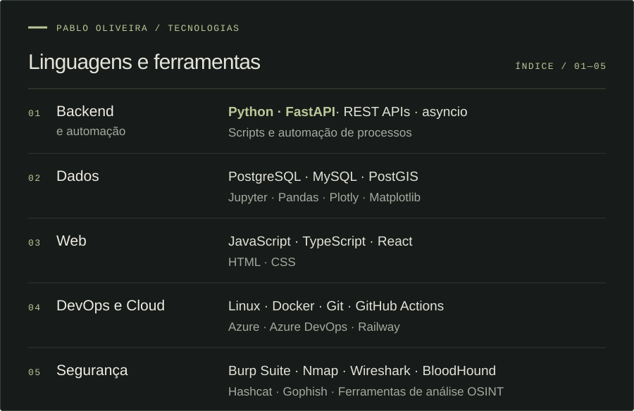
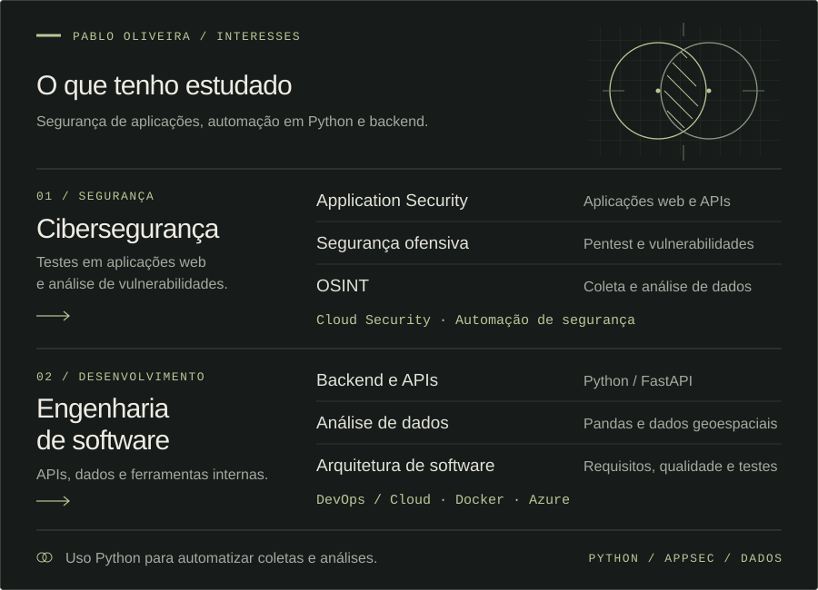
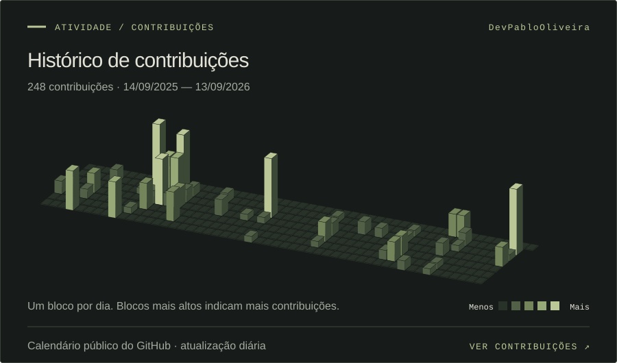
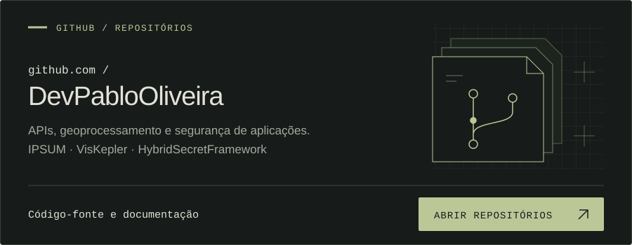

# Pablo Oliveira

Sou graduando em **Engenharia de Software na Universidade Federal do Amazonas (UFAM)**. Trabalho com testes de segurança em aplicações, automações em Python e coleta e análise de informações para OSINT.

Comecei pelo desenvolvimento de software e pela análise de dados. Aos poucos, passei a trabalhar mais com segurança, mantendo o desenvolvimento de APIs e ferramentas internas.

## Projetos

- **[IPSUM](https://github.com/nupec/IPSUM)** — Backend em Python e FastAPI para alocação de demandas a equipamentos públicos, como Unidades Básicas de Saúde. Inclui processamento de dados geoespaciais, diferentes métodos de cálculo de distância e geração de relatórios.
- **[VisKepler](https://github.com/DevPabloOliveira/VisKepler)** — Dashboard de visualização geoespacial com Kepler.gl e FastAPI. Contribuí com melhorias na interface, na lógica dos mapas, na infraestrutura Docker e no tratamento de erros.
- **[HybridSecretFramework](https://github.com/DevPabloOliveira/HybridSecretFramework)** — Framework em Python para detectar segredos expostos em artefatos obtidos do GitHub. Combina expressões regulares, análise de AST e classificação por aprendizado de máquina.

## Tecnologias

Ver tecnologias em texto

- **Backend e automação:** Python, FastAPI, REST APIs, asyncio, scripts e automação de processos.
- **Dados:** PostgreSQL, MySQL, PostGIS, Jupyter, Pandas, Plotly e Matplotlib.
- **Web:** JavaScript, TypeScript, React, HTML e CSS.
- **DevOps e Cloud:** Linux, Docker, Git, GitHub Actions, Azure, Azure DevOps e Railway.
- **Segurança:** Burp Suite, Nmap, Wireshark, BloodHound, Hashcat, Gophish e ferramentas de análise OSINT.

## Áreas de interesse

Ver áreas de interesse em texto

- **Cibersegurança:** segurança de aplicações web e APIs, pentest, análise de vulnerabilidades, OSINT, Cloud Security e automação de segurança com Python.
- **Engenharia de software:** backend com Python e FastAPI, APIs, análise de dados geoespaciais, arquitetura, requisitos, qualidade, testes e DevOps.

## Contribuições

## Repositórios

